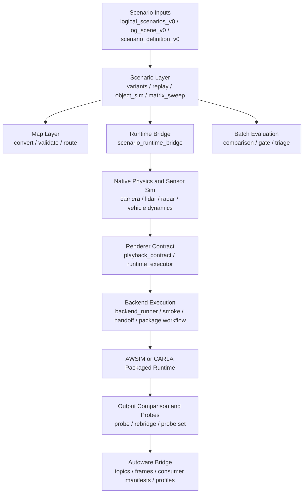

# Implementation Architecture Guide

## Purpose

This repository is the canonical implementation for the current open simulation stack.

It is not a full clone of the entire Applied Intuition product suite. The implemented core is:

- scenario authoring and replay
- object simulation
- native sensor simulation
- runtime and backend smoke execution
- AWSIM packaged-runtime verification
- Autoware-facing data-contract export

Historical work from `Autonomy-E2E` is preserved as provenance and migration reference, not as the implementation source of truth.

## Current Goal

The current practical goal is:

`scenario -> object sim -> native sensor sim -> runtime/backend smoke -> real AWSIM run -> Autoware ingest contract`

This is the shortest path to a usable native-run stack. It is narrower than a full cloud, HIL, data-explorer, or neural-sim product line.

## System Overview

## Repository Layout

### Source code

- [/Users/seongcheoljeong/Documents/Test/src/hybrid_sensor_sim/scenarios](/Users/seongcheoljeong/Documents/Test/src/hybrid_sensor_sim/scenarios)
  - scenario schema, object sim, replay, variants, matrix sweep
- [/Users/seongcheoljeong/Documents/Test/src/hybrid_sensor_sim/physics](/Users/seongcheoljeong/Documents/Test/src/hybrid_sensor_sim/physics)
  - camera and vehicle dynamics
- [/Users/seongcheoljeong/Documents/Test/src/hybrid_sensor_sim/backends](/Users/seongcheoljeong/Documents/Test/src/hybrid_sensor_sim/backends)
  - native sensor physics and HELIOS integration
- [/Users/seongcheoljeong/Documents/Test/src/hybrid_sensor_sim/maps](/Users/seongcheoljeong/Documents/Test/src/hybrid_sensor_sim/maps)
  - canonical map conversion, validation, routing
- [/Users/seongcheoljeong/Documents/Test/src/hybrid_sensor_sim/renderers](/Users/seongcheoljeong/Documents/Test/src/hybrid_sensor_sim/renderers)
  - playback contract, runtime executor, backend runner
- [/Users/seongcheoljeong/Documents/Test/src/hybrid_sensor_sim/autoware](/Users/seongcheoljeong/Documents/Test/src/hybrid_sensor_sim/autoware)
  - topic, frame, consumer manifest, and pipeline bridge logic
- [/Users/seongcheoljeong/Documents/Test/src/hybrid_sensor_sim/tools](/Users/seongcheoljeong/Documents/Test/src/hybrid_sensor_sim/tools)
  - top-level workflows, smoke tools, runtime probes, package acquire/stage, provenance tooling
- [/Users/seongcheoljeong/Documents/Test/src/hybrid_sensor_sim/io](/Users/seongcheoljeong/Documents/Test/src/hybrid_sensor_sim/io)
  - file and provenance helpers

### Operational surfaces

- [/Users/seongcheoljeong/Documents/Test/scripts](/Users/seongcheoljeong/Documents/Test/scripts)
  - thin CLI wrappers around library workflows
- [/Users/seongcheoljeong/Documents/Test/tests](/Users/seongcheoljeong/Documents/Test/tests)
  - regression suite and fixtures
- [/Users/seongcheoljeong/Documents/Test/configs](/Users/seongcheoljeong/Documents/Test/configs)
  - example smoke and runtime configs
- [/Users/seongcheoljeong/Documents/Test/artifacts](/Users/seongcheoljeong/Documents/Test/artifacts)
  - generated execution outputs and probe reports
- [/Users/seongcheoljeong/Documents/Test/metadata/autonomy_e2e](/Users/seongcheoljeong/Documents/Test/metadata/autonomy_e2e)
  - checked-in provenance ledger for historical traceability

## Top-Level Directory Guide

| Path | What it contains | When to look here |
| --- | --- | --- |
| [/Users/seongcheoljeong/Documents/Test/src/hybrid_sensor_sim](/Users/seongcheoljeong/Documents/Test/src/hybrid_sensor_sim) | canonical library implementation | when changing real behavior |
| [/Users/seongcheoljeong/Documents/Test/scripts](/Users/seongcheoljeong/Documents/Test/scripts) | thin CLI wrappers | when you want the runnable entrypoint |
| [/Users/seongcheoljeong/Documents/Test/tests](/Users/seongcheoljeong/Documents/Test/tests) | regression tests and fixtures | when verifying expected behavior |
| [/Users/seongcheoljeong/Documents/Test/configs](/Users/seongcheoljeong/Documents/Test/configs) | smoke/runtime example configs | when reproducing a workflow |
| [/Users/seongcheoljeong/Documents/Test/artifacts](/Users/seongcheoljeong/Documents/Test/artifacts) | generated runtime outputs, reports, probes | when checking what actually happened |
| [/Users/seongcheoljeong/Documents/Test/docs](/Users/seongcheoljeong/Documents/Test/docs) | narrative architecture, migration, and planning docs | when onboarding or understanding intent |
| [/Users/seongcheoljeong/Documents/Test/metadata/autonomy_e2e](/Users/seongcheoljeong/Documents/Test/metadata/autonomy_e2e) | machine-readable provenance ledger | when tracing history and migrated blocks |

Operational rule:

- implementation truth lives in `src/`
- runnable surfaces live in `scripts/`
- expected behavior lives in `tests/`
- historical traceability lives in `metadata/autonomy_e2e/`
- `artifacts/` are execution byproducts, not source of truth

## Layer-by-Layer Description

### 1. Scenario layer

Main files:

- [/Users/seongcheoljeong/Documents/Test/src/hybrid_sensor_sim/scenarios/schema.py](/Users/seongcheoljeong/Documents/Test/src/hybrid_sensor_sim/scenarios/schema.py)
- [/Users/seongcheoljeong/Documents/Test/src/hybrid_sensor_sim/scenarios/object_sim.py](/Users/seongcheoljeong/Documents/Test/src/hybrid_sensor_sim/scenarios/object_sim.py)
- [/Users/seongcheoljeong/Documents/Test/src/hybrid_sensor_sim/scenarios/replay.py](/Users/seongcheoljeong/Documents/Test/src/hybrid_sensor_sim/scenarios/replay.py)
- [/Users/seongcheoljeong/Documents/Test/src/hybrid_sensor_sim/scenarios/variants.py](/Users/seongcheoljeong/Documents/Test/src/hybrid_sensor_sim/scenarios/variants.py)
- [/Users/seongcheoljeong/Documents/Test/src/hybrid_sensor_sim/scenarios/matrix_sweep.py](/Users/seongcheoljeong/Documents/Test/src/hybrid_sensor_sim/scenarios/matrix_sweep.py)

Responsibilities:

- validate scenario inputs
- run deterministic object simulation
- convert `log_scene_v0` into executable scenarios
- generate parameter variants
- run scenario matrices and summarize outcomes

Outputs:

- `summary.json`
- `trace.csv`
- `lane_risk_summary.json`
- scenario variant and batch reports

### 2. Map layer

Main files:

- [/Users/seongcheoljeong/Documents/Test/src/hybrid_sensor_sim/maps/convert.py](/Users/seongcheoljeong/Documents/Test/src/hybrid_sensor_sim/maps/convert.py)
- [/Users/seongcheoljeong/Documents/Test/src/hybrid_sensor_sim/maps/validate.py](/Users/seongcheoljeong/Documents/Test/src/hybrid_sensor_sim/maps/validate.py)
- [/Users/seongcheoljeong/Documents/Test/src/hybrid_sensor_sim/maps/route.py](/Users/seongcheoljeong/Documents/Test/src/hybrid_sensor_sim/maps/route.py)

Responsibilities:

- convert `simple_map_v0` and `canonical_lane_graph_v0`
- validate route/lane semantics
- compute route sequences for scenario consumption

This layer is utility-first. It is not a full map editing product.

### 3. Native physics and sensor simulation

Main files:

- [/Users/seongcheoljeong/Documents/Test/src/hybrid_sensor_sim/physics/camera.py](/Users/seongcheoljeong/Documents/Test/src/hybrid_sensor_sim/physics/camera.py)
- [/Users/seongcheoljeong/Documents/Test/src/hybrid_sensor_sim/physics/vehicle_dynamics.py](/Users/seongcheoljeong/Documents/Test/src/hybrid_sensor_sim/physics/vehicle_dynamics.py)
- [/Users/seongcheoljeong/Documents/Test/src/hybrid_sensor_sim/backends/native_physics.py](/Users/seongcheoljeong/Documents/Test/src/hybrid_sensor_sim/backends/native_physics.py)
- [/Users/seongcheoljeong/Documents/Test/src/hybrid_sensor_sim/backends/helios_adapter.py](/Users/seongcheoljeong/Documents/Test/src/hybrid_sensor_sim/backends/helios_adapter.py)

Responsibilities:

- camera projection and image-oriented output modeling
- vehicle motion traces for ego dynamics
- lidar/radar/camera native preview and artifact generation
- HELIOS-backed survey/runtime integration

This layer is the core of the current sensor simulation implementation.

### 4. Runtime and backend execution layer

Main files:

- [/Users/seongcheoljeong/Documents/Test/src/hybrid_sensor_sim/renderers/playback_contract.py](/Users/seongcheoljeong/Documents/Test/src/hybrid_sensor_sim/renderers/playback_contract.py)
- [/Users/seongcheoljeong/Documents/Test/src/hybrid_sensor_sim/renderers/runtime_executor.py](/Users/seongcheoljeong/Documents/Test/src/hybrid_sensor_sim/renderers/runtime_executor.py)
- [/Users/seongcheoljeong/Documents/Test/src/hybrid_sensor_sim/renderers/backend_runner.py](/Users/seongcheoljeong/Documents/Test/src/hybrid_sensor_sim/renderers/backend_runner.py)

Responsibilities:

- convert scenario and sensor outputs into runtime/backend contracts
- execute AWSIM/CARLA through wrapper or direct runner paths
- inspect output layout and compare it against expected contracts

This is the layer that turns native simulation outputs into runnable backend workflows.

### 5. Workflow and orchestration layer

Main files:

- [/Users/seongcheoljeong/Documents/Test/src/hybrid_sensor_sim/tools/scenario_backend_smoke_workflow.py](/Users/seongcheoljeong/Documents/Test/src/hybrid_sensor_sim/tools/scenario_backend_smoke_workflow.py)
- [/Users/seongcheoljeong/Documents/Test/src/hybrid_sensor_sim/tools/scenario_runtime_backend_workflow.py](/Users/seongcheoljeong/Documents/Test/src/hybrid_sensor_sim/tools/scenario_runtime_backend_workflow.py)
- [/Users/seongcheoljeong/Documents/Test/src/hybrid_sensor_sim/tools/scenario_runtime_backend_rebridge.py](/Users/seongcheoljeong/Documents/Test/src/hybrid_sensor_sim/tools/scenario_runtime_backend_rebridge.py)
- [/Users/seongcheoljeong/Documents/Test/src/hybrid_sensor_sim/tools/scenario_runtime_backend_probe.py](/Users/seongcheoljeong/Documents/Test/src/hybrid_sensor_sim/tools/scenario_runtime_backend_probe.py)
- [/Users/seongcheoljeong/Documents/Test/src/hybrid_sensor_sim/tools/scenario_runtime_backend_probe_set.py](/Users/seongcheoljeong/Documents/Test/src/hybrid_sensor_sim/tools/scenario_runtime_backend_probe_set.py)
- [/Users/seongcheoljeong/Documents/Test/src/hybrid_sensor_sim/tools/renderer_backend_workflow.py](/Users/seongcheoljeong/Documents/Test/src/hybrid_sensor_sim/tools/renderer_backend_workflow.py)

Responsibilities:

- materialize smoke-ready scenarios
- run backend smoke and collect comparison artifacts
- rerun bridge logic on existing artifacts without rerunning the backend
- summarize runtime readiness and blockers
- produce actionable next-step plans for AWSIM/CARLA runtime closure

### 6. Autoware bridge layer

Main files:

- [/Users/seongcheoljeong/Documents/Test/src/hybrid_sensor_sim/autoware/contracts.py](/Users/seongcheoljeong/Documents/Test/src/hybrid_sensor_sim/autoware/contracts.py)
- [/Users/seongcheoljeong/Documents/Test/src/hybrid_sensor_sim/autoware/topics.py](/Users/seongcheoljeong/Documents/Test/src/hybrid_sensor_sim/autoware/topics.py)
- [/Users/seongcheoljeong/Documents/Test/src/hybrid_sensor_sim/autoware/frames.py](/Users/seongcheoljeong/Documents/Test/src/hybrid_sensor_sim/autoware/frames.py)
- [/Users/seongcheoljeong/Documents/Test/src/hybrid_sensor_sim/autoware/pipeline_manifest.py](/Users/seongcheoljeong/Documents/Test/src/hybrid_sensor_sim/autoware/pipeline_manifest.py)
- [/Users/seongcheoljeong/Documents/Test/src/hybrid_sensor_sim/autoware/export_bridge.py](/Users/seongcheoljeong/Documents/Test/src/hybrid_sensor_sim/autoware/export_bridge.py)
- [/Users/seongcheoljeong/Documents/Test/src/hybrid_sensor_sim/autoware/profiles.py](/Users/seongcheoljeong/Documents/Test/src/hybrid_sensor_sim/autoware/profiles.py)

Responsibilities:

- map backend smoke outputs into Autoware-facing topic contracts
- build frame-tree and static transform metadata
- generate consumer input manifests and processing-stage summaries
- classify readiness as `READY`, `DEGRADED`, `PLANNED`, or sidecar/mixed equivalents

This layer is JSON-first. It intentionally does not depend on ROS runtime in the current phase.

## Main Workflows

### Scenario and object-sim workflow

Use:

- [/Users/seongcheoljeong/Documents/Test/scripts/run_object_sim.py](/Users/seongcheoljeong/Documents/Test/scripts/run_object_sim.py)
- [/Users/seongcheoljeong/Documents/Test/scripts/run_log_replay.py](/Users/seongcheoljeong/Documents/Test/scripts/run_log_replay.py)
- [/Users/seongcheoljeong/Documents/Test/scripts/run_scenario_variants.py](/Users/seongcheoljeong/Documents/Test/scripts/run_scenario_variants.py)
- [/Users/seongcheoljeong/Documents/Test/scripts/run_scenario_batch_workflow.py](/Users/seongcheoljeong/Documents/Test/scripts/run_scenario_batch_workflow.py)

Use this path when the task is about scenario logic, replay, or risk evaluation.

### Runtime and backend smoke workflow

Use:

- [/Users/seongcheoljeong/Documents/Test/scripts/run_scenario_backend_smoke_workflow.py](/Users/seongcheoljeong/Documents/Test/scripts/run_scenario_backend_smoke_workflow.py)
- [/Users/seongcheoljeong/Documents/Test/scripts/run_scenario_runtime_backend_workflow.py](/Users/seongcheoljeong/Documents/Test/scripts/run_scenario_runtime_backend_workflow.py)
- [/Users/seongcheoljeong/Documents/Test/scripts/run_renderer_backend_workflow.py](/Users/seongcheoljeong/Documents/Test/scripts/run_renderer_backend_workflow.py)

Use this path when the task is about turning a scenario into a backend-run smoke test.

### Runtime probe and rebridge workflow

Use:

- [/Users/seongcheoljeong/Documents/Test/scripts/run_scenario_runtime_backend_rebridge.py](/Users/seongcheoljeong/Documents/Test/scripts/run_scenario_runtime_backend_rebridge.py)
- [/Users/seongcheoljeong/Documents/Test/scripts/run_scenario_runtime_backend_probe.py](/Users/seongcheoljeong/Documents/Test/scripts/run_scenario_runtime_backend_probe.py)
- [/Users/seongcheoljeong/Documents/Test/scripts/run_scenario_runtime_backend_probe_set.py](/Users/seongcheoljeong/Documents/Test/scripts/run_scenario_runtime_backend_probe_set.py)

Use this path when the backend was already run and you want:

- refreshed Autoware bridge results
- semantic recovery checks
- runtime strategy recommendations
- blocker summaries

### Autoware export workflow

Use:

- [/Users/seongcheoljeong/Documents/Test/scripts/run_autoware_pipeline_bridge.py](/Users/seongcheoljeong/Documents/Test/scripts/run_autoware_pipeline_bridge.py)

Use this path when the task is about downstream ingest contracts rather than backend execution itself.

## Typical Newcomer Tasks

### Understand the stack

Read in this order:

1. [README.md](/Users/seongcheoljeong/Documents/Test/README.md)
2. this architecture guide
3. [/Users/seongcheoljeong/Documents/Test/docs/autonomy_e2e_migration_master_plan.md](/Users/seongcheoljeong/Documents/Test/docs/autonomy_e2e_migration_master_plan.md)
4. [/Users/seongcheoljeong/Documents/Test/docs/p_sim_engine_migration_audit.md](/Users/seongcheoljeong/Documents/Test/docs/p_sim_engine_migration_audit.md)

### Run a scenario locally

Start with:

- [/Users/seongcheoljeong/Documents/Test/scripts/run_object_sim.py](/Users/seongcheoljeong/Documents/Test/scripts/run_object_sim.py)
- [/Users/seongcheoljeong/Documents/Test/scripts/run_log_replay.py](/Users/seongcheoljeong/Documents/Test/scripts/run_log_replay.py)

### Understand runtime/backend readiness

Start with:

- [/Users/seongcheoljeong/Documents/Test/scripts/run_scenario_runtime_backend_workflow.py](/Users/seongcheoljeong/Documents/Test/scripts/run_scenario_runtime_backend_workflow.py)
- [/Users/seongcheoljeong/Documents/Test/scripts/run_scenario_runtime_backend_probe_set.py](/Users/seongcheoljeong/Documents/Test/scripts/run_scenario_runtime_backend_probe_set.py)

### Trace historical origin of a current module

Use:

- [/Users/seongcheoljeong/Documents/Test/scripts/run_autonomy_e2e_history_query.py](/Users/seongcheoljeong/Documents/Test/scripts/run_autonomy_e2e_history_query.py)
- [/Users/seongcheoljeong/Documents/Test/metadata/autonomy_e2e](/Users/seongcheoljeong/Documents/Test/metadata/autonomy_e2e)

## Runtime Status Model

Top-level runtime workflows intentionally separate:

- process-level failures
- runtime-origin output availability
- output comparison correctness
- Autoware downstream readiness

Important statuses:

- `SUCCEEDED`
  - runtime-origin outputs are usable and downstream contract is satisfied
- `DEGRADED`
  - runtime-origin outputs exist but required downstream topics or profiles are incomplete
- `ATTENTION`
  - outputs or runtime strategy still require human action
- `FAILED`
  - workflow could not produce a usable result

## Current Practical State

The current strongest verified path is `AWSIM`.

Confirmed:

- real AWSIM packaged handoff path exists
- `tracking_fusion_v0` is runtime-origin `READY`
- `semantic_perception_v0` can be `READY`
  - primary semantic output if available
  - or semantic supplemental recovery when required

Main remaining practical gap:

- `CARLA` real packaged parity

The current blocker for `CARLA` is operational:

- runtime acquisition
- download/stage space
- local Docker/containerd health

Not architectural.

## Newcomer Starting Points

If you are new to this repository, start in this order:

1. [README.md](/Users/seongcheoljeong/Documents/Test/README.md)
2. this architecture guide
3. [/Users/seongcheoljeong/Documents/Test/docs/autonomy_e2e_migration_master_plan.md](/Users/seongcheoljeong/Documents/Test/docs/autonomy_e2e_migration_master_plan.md)
4. [/Users/seongcheoljeong/Documents/Test/docs/p_sim_engine_migration_audit.md](/Users/seongcheoljeong/Documents/Test/docs/p_sim_engine_migration_audit.md)
5. [/Users/seongcheoljeong/Documents/Test/metadata/autonomy_e2e](/Users/seongcheoljeong/Documents/Test/metadata/autonomy_e2e)

Then use these practical entry points:

- scenario logic:
  - [/Users/seongcheoljeong/Documents/Test/scripts/run_object_sim.py](/Users/seongcheoljeong/Documents/Test/scripts/run_object_sim.py)
- runtime/backend smoke:
  - [/Users/seongcheoljeong/Documents/Test/scripts/run_scenario_runtime_backend_workflow.py](/Users/seongcheoljeong/Documents/Test/scripts/run_scenario_runtime_backend_workflow.py)
- runtime blockers and next actions:
  - [/Users/seongcheoljeong/Documents/Test/scripts/run_scenario_runtime_backend_probe_set.py](/Users/seongcheoljeong/Documents/Test/scripts/run_scenario_runtime_backend_probe_set.py)
- Autoware contracts:
  - [/Users/seongcheoljeong/Documents/Test/scripts/run_autoware_pipeline_bridge.py](/Users/seongcheoljeong/Documents/Test/scripts/run_autoware_pipeline_bridge.py)

## What This Repository Is Not

This repository is not:

- a full cloud simulation platform
- a full data explorer product
- a full HIL product
- a full neural simulation product
- a full ROS2/Autoware runtime workspace

Those may become future work, but they are not the current implementation boundary.
